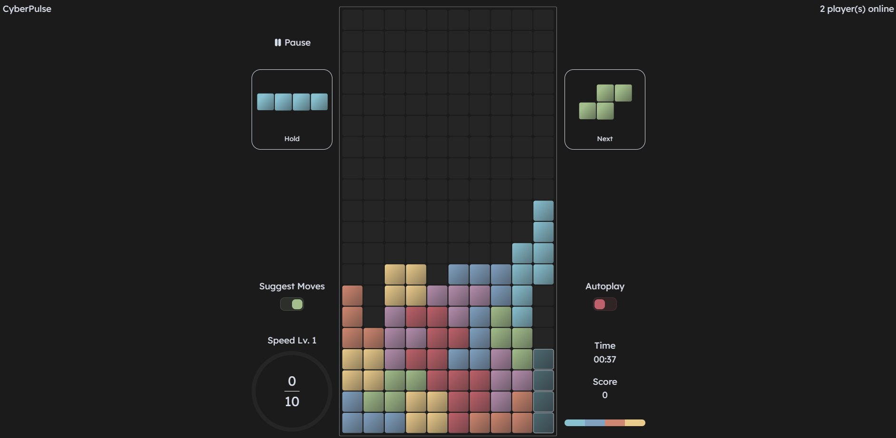
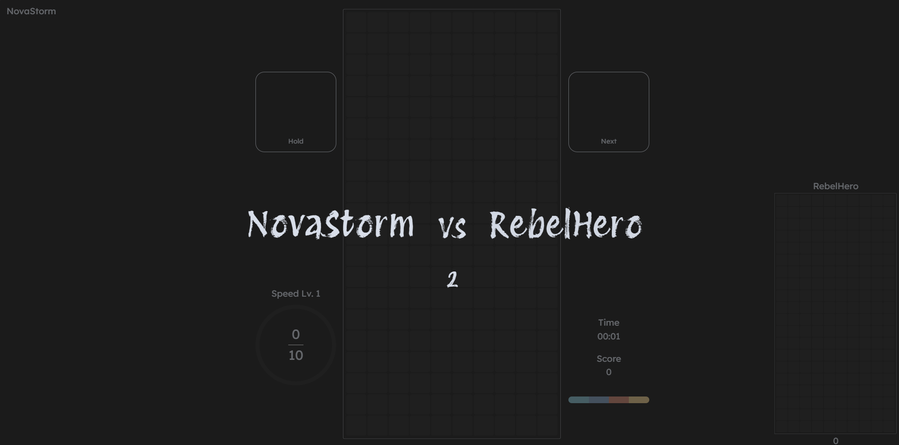
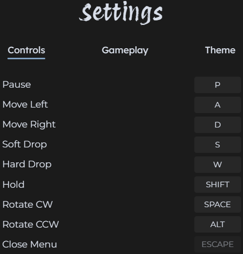
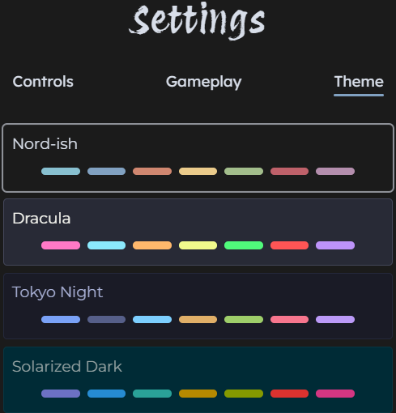

[](https://tetris.jpbhatt.tech/)  

### A modern web-based Tetris app featuring classic gameplay, advanced move suggestions, online multiplayer, and full customization options.

#### Try Webtris [here](https://tetris.jpbhatt.tech/).

## Features

- **Modern Tetris Gameplay**  
  Enjoy fast, fluid play with the latest Tetris mechanics (SRS rotation, 7-bag randomizer, hold piece, ghost piece, and more).

- **Move Suggestions**  
  Get real-time hints for optimal piece placement and strategy.

- **Adjustable Auto Play**  
  Let the AI play for you at customizable speeds-perfect for learning or just watching the action.

- **Online Player vs Player**  
  Challenge random opponents in real-time online matches.

- **Customizable Controls**  
  Remap every action (move, rotate, drop, hold, pause) to your preferred keys.

- **Customizable Theme**  
  Switch between different themes with background and block colors to personalize your experience.

## Installation

1. Clone the repo:  
   ```bash
   git clone https://github.com/jpbhatt21/webtris.git
   cd cengine
   ```
2. Install dependencies:  
   ```bash
   npm install
   ```


## Usage
```bash
npm run dev
```
- ### Select *Singleplayer* for solo play with move suggestions or auto play.

    [](https://tetris.jpbhatt.tech/)  


- ### Choose *Multiplayer* to join a public match.

    [](https://tetris.jpbhatt.tech/) 


- ### Adjust controls and themes in the *Settings* menu.

    [](https://tetris.jpbhatt.tech/)-[](https://tetris.jpbhatt.tech/) 

## License
Distributed under the MIT License.
